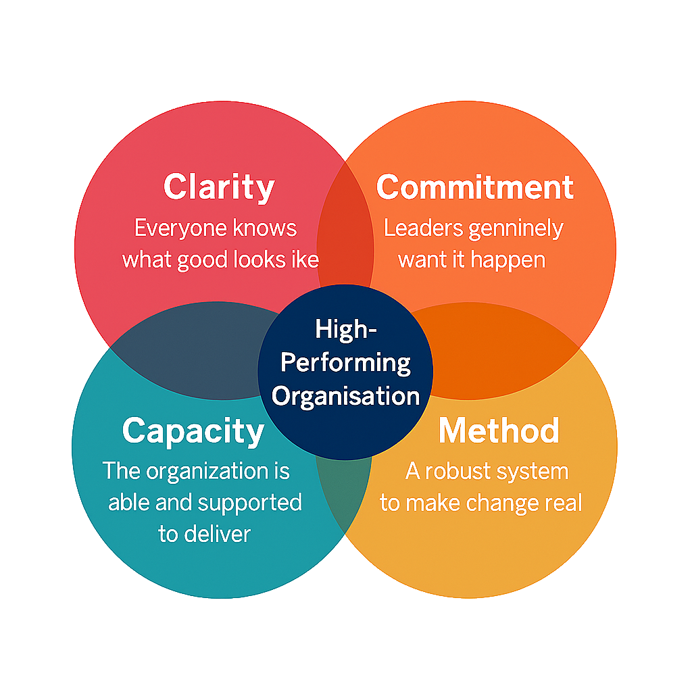

## Building Blocks
### Four Foundations To Enable High‑Performance Strategy Delivery

The Structured Empathy Framework is designed to enable organisations to work along the other key building blocks to create an organsiation founded on a culture of Psychological Safety, in turn allowing the organisation to deliver their strategy with the highest performance.

The four building blocks are:
- **Clarity** — Everyone knows what good looks like

Clarity is the anchor of strategic performance. When people can see what good looks like (vividly, simply, and consistently) they can align their decisions and behaviours without constant supervision. Clarity removes ambiguity, reduces friction, and creates a shared language for progress. It turns strategy from an abstract idea into something people can recognise, describe, and commit to.

- **Commitment** — Leaders genuinely want it to happen

Commitment is the emotional and practical fuel of change. It’s not just endorsement; it’s ownership. When leaders demonstrate genuine desire for the strategy to succeed (through prioritisation, resourcing, and visible behaviour) the organisation feels it. Commitment signals seriousness. It creates momentum. And it sets the tone for what matters most.

- **Capacity** — The organisation is able and supported to deliver

Capacity is the organisational muscle that turns intent into movement. It includes followership, skills, time, resources, and the psychological safety to act. Without capacity, even the clearest strategy and strongest leadership commitment stall. When people are supported, equipped, and empowered, they can deliver change with confidence and consistency.

- **Method** — A robust system to make change real

Method is the engine room. It provides structure, repeatability, and discipline. This is where the Structured Empathy Framework fits, ensuring that change is not left to chance. Method turns strategy into a series of understandable, executable steps. It reduces risk, accelerates learning, and ensures that progress is measurable and sustainable.

## How the Four Conditions Work Together
These four conditions are not independent; they are interlocking forces that create a high‑performing organisation when they overlap.
- Clarity + Commitment create strategic intent — a shared vision backed by leadership will.
- Commitment + Capacity create executable leadership — leaders who not only want change but enable it.
- Capacity + Method create operational momentum — teams who can deliver consistently and confidently.
- Clarity + Method create consistent delivery — a clear destination supported by a reliable path.

At the centre — where all four conditions overlap — is the outcome every organisation seeks: **A High‑Performing Organisation**

